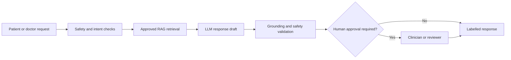

# AI Requirements

## Purpose

Define governed AI behaviour for patient and clinician assistance.

## Scope

LLM interaction, RAG, vector search, prompts, safety, and human approval.

## Actors

Patients, doctors, administrators, AI services, reviewers, and agents.

## Requirements

- LLM interactions shall identify the task, permitted context, model/version, and safety policy applied.
- RAG workflows shall retrieve only approved, versioned knowledge sources and retain source references for review.
- Vector search shall use access-aware filtering, relevance thresholds, and evaluation datasets before release.
- Prompt templates shall be versioned, reviewed, tested, and protected from unauthorised modification.
- AI safety controls shall detect unsupported clinical claims, harmful instructions, prompt injection, and uncertainty requiring escalation.
- Human approval shall be required for configured patient-facing, clinical, or consequential outputs; approvers may edit or reject drafts.

## Assumptions

Approved knowledge governance and model evaluation processes exist.

## Constraints

AI is assistive and may not make autonomous diagnoses, prescriptions, or emergency determinations.

## Future considerations

Add model routing, offline evaluation, and market-specific safety policies.
