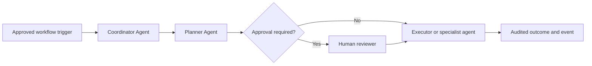

# Agent Requirements

## Purpose

Define governed agentic and multi-agent workflow behaviour.

## Scope

Health Journey Agent, specialised assistants, tool use, workflow state, and human-in-the-loop controls.

## Actors

Patients, doctors, administrators, agents, orchestrators, and human reviewers.

## Detailed description

This document defines the enterprise healthcare platform baseline for its stated scope. It is read with the SRS and the business foundation, and remains subject to clinical, privacy, security, and operational governance.

## Requirements

| Agent | Responsibility | Input / output | Trigger | Human approval point |
| --- | --- | --- | --- | --- |
| Coordinator Agent | Route requests and maintain workflow state. | Intent and context / assigned workflow. | New approved task. | Before consequential routing. |
| Planner Agent | Produce a bounded, policy-aware execution plan. | Goal and constraints / reviewable plan. | Coordinator assignment. | Plan approval when configured. |
| Executor Agent | Perform authorised tool calls and record outcomes. | Approved plan / task results. | Approved plan step. | Before external or patient-impacting action. |
| Health Journey Agent | Support reminders, follow-up, and care-plan progression. | Care-plan events / next steps. | Appointment or care event. | Before patient-facing clinical content. |
| Symptom Agent | Structure reported symptoms for clinician review. | Patient input / structured summary. | Patient consultation. | Required before clinical interpretation. |
| Medication Agent | Present approved medication information and reminders. | Medication context / draft guidance. | Approved request. | Required for medication changes or advice. |
| Doctor Copilot Agent | Draft clinician-facing summaries and notes. | Consultation context / draft. | Doctor request. | Doctor must approve before save or sharing. |

- Each agent shall have a declared goal, owner, permitted data, tools, and termination conditions.
- Agents shall perform only responsibilities explicitly assigned by policy, such as reminders, care-plan follow-up, or information gathering.
- Agent-to-agent communication shall use structured messages, correlation IDs, permission checks, and auditable state transitions.
- Workflow execution shall support retries, idempotency, timeouts, compensation, and safe failure handling.
- Human-in-the-loop controls shall pause, approve, modify, reject, or terminate configured actions.
- Agents shall not independently perform clinical decisions or actions beyond their authorised scope.

## Assumptions

Agent policies and tool contracts are governed and reviewed.

## Constraints

Multi-agent autonomy is bounded by safety, privacy, and clinical policies.

## Dependencies

This document depends on approved clinical governance, privacy and security policies, and the related requirements in this directory.

## Future enhancements

Introduce evaluated agent roles and simulation before production expansion.
