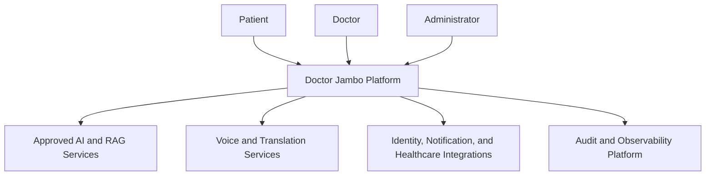

# System Requirements Specification

## Purpose

Define the product-level system requirements for Doctor Jambo.

## Scope

Doctor Jambo supports patient AI consultation, doctor AI copilot assistance, voice healthcare interaction, RAG-based medical knowledge retrieval, and governed multi-agent workflows.

## Actors

Patients, caregivers, doctors, clinic administrators, platform administrators, approved AI services, and external providers.

## Detailed description

This document defines the enterprise healthcare platform baseline for its stated scope. It is read with the SRS and the business foundation, and remains subject to clinical, privacy, security, and operational governance.

## Requirements

- The system shall deliver secure, role-aware patient and clinician journeys.
- The system shall preserve human clinical responsibility and provide emergency escalation guidance.
- The system shall make AI outputs traceable to approved knowledge sources and interaction context.
- The system shall support asynchronous, event-driven workflows for appointments, notifications, and agent tasks.

## Assumptions

Approved providers and knowledge sources are available; users have supported devices and connectivity.

## Constraints

Jurisdictional licensing, privacy law, clinical policy, and integration contracts constrain release scope.

## Dependencies

This document depends on approved clinical governance, privacy and security policies, and the related requirements in this directory.

## Future enhancements

Implementation may use Java 25, Spring Boot 4+, Spring Cloud, Spring AI, LangChain4j, Embabel, MCP, microservices, Domain-Driven Design, and event-driven architecture after architecture approval.
