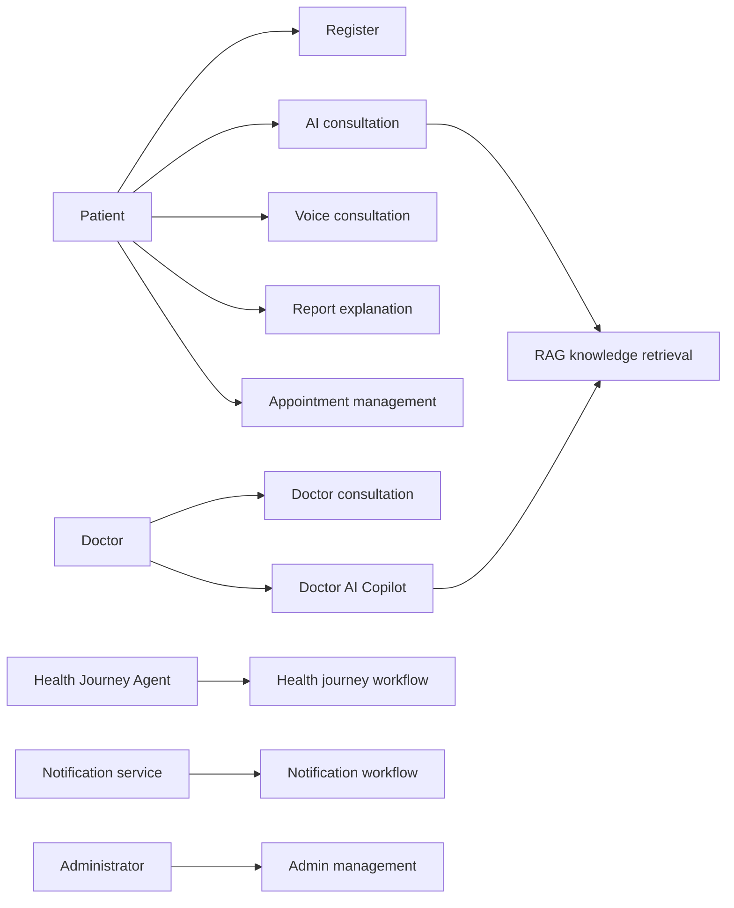

# Use Case Model

## Purpose

Identify primary actor interactions with the system.

## Scope

The ten core use cases for the first product roadmap.

## Actors

Patient, doctor, administrator, AI service, voice service, and health journey agent.

## Requirements

## Assumptions

Each use case has an authorised actor and a defined outcome.

## Constraints

Emergency cases require guidance to appropriate emergency channels.

## Future considerations

Extend the model for caregiver delegation and partner systems.
