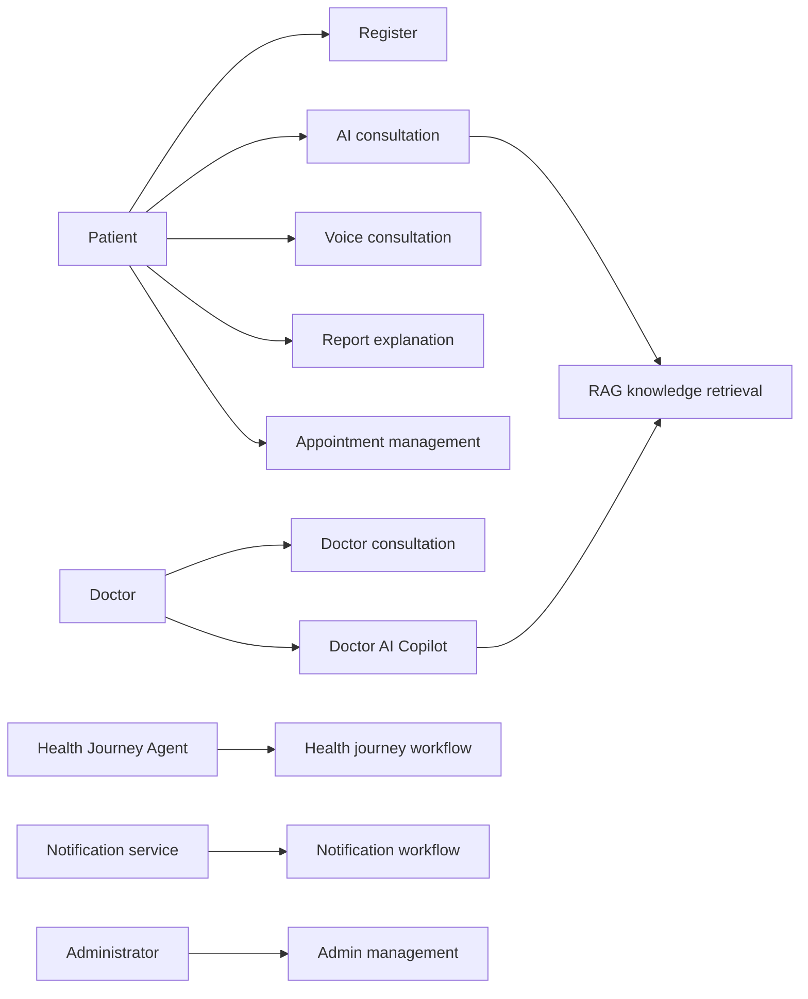

# Use Case Model

## Purpose

Identify primary actor interactions with the system.

## Scope

The ten core use cases for the first product roadmap.

## Actors

Patient, doctor, administrator, AI service, voice service, and health journey agent.

## Detailed description

This document defines the enterprise healthcare platform baseline for its stated scope. It is read with the SRS and the business foundation, and remains subject to clinical, privacy, security, and operational governance.

## Requirements

## Assumptions

Each use case has an authorised actor and a defined outcome.

## Constraints

Emergency cases require guidance to appropriate emergency channels.

## Dependencies

This document depends on approved clinical governance, privacy and security policies, and the related requirements in this directory.

## Future enhancements

Extend the model for caregiver delegation and partner systems.
