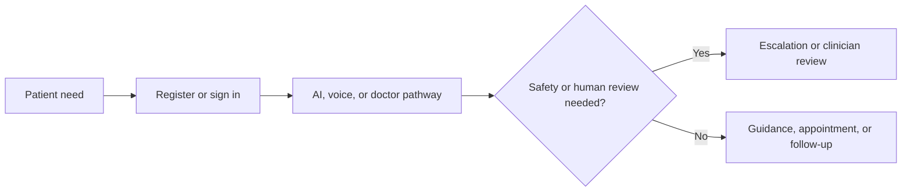

# User Stories

## Purpose

Describe user outcomes that guide backlog refinement.

## Scope

Patient, doctor, voice, AI, and administrative journeys.

## Actors

Patients, doctors, administrators, and supervised agents.

## Requirements

- As a patient, I want to register and set my consent preferences so that I control my information.
- As a patient, I want AI-assisted health guidance with clear limits so that I can decide an appropriate next step.
- As a patient, I want to speak in a supported language so that I can interact without typing.
- As a patient, I want a medical report explained in plain language so that I can prepare questions for my doctor.
- As a doctor, I want an AI copilot to draft a consultation summary so that I can spend more time on care.
- As a doctor, I want to approve AI suggestions before they become part of a patient-facing outcome.
- As an administrator, I want to verify providers and monitor workflow exceptions so that the service remains trustworthy.

## Assumptions

Stories are refined with representative users and clinical governance.

## Constraints

Stories do not authorise unsupported clinical claims.

## Future considerations

Add accessibility and regional-language stories as markets expand.
