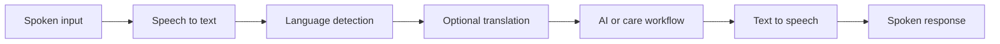

# Voice Requirements

## Purpose

Define safe and accessible voice-based healthcare interaction.

## Scope

Speech-to-text, language detection, translation, text-to-speech, and real-time conversation.

## Actors

Patients, doctors, voice services, translators, and AI safety services.

## Detailed description

This document defines the enterprise healthcare platform baseline for its stated scope. It is read with the SRS and the business foundation, and remains subject to clinical, privacy, security, and operational governance.

## Requirements

- The system shall capture speech only with clear user indication and applicable consent.
- The system shall provide speech-to-text transcripts with confidence information and correction controls.
- The system shall detect supported languages and disclose when confidence is insufficient.
- The system shall translate only through approved services and preserve the original input where policy permits.
- The system shall generate text-to-speech output suitable for the selected supported language.
- Real-time conversations shall expose connection, processing, and failure states without concealing delays.

## Assumptions

Users can review key transcripts before they drive consequential actions.

## Constraints

Voice data is sensitive and subject to consent, retention, and vendor controls.

## Dependencies

This document depends on approved clinical governance, privacy and security policies, and the related requirements in this directory.

## Future enhancements

Improve regional dialect support and accessibility modes.
