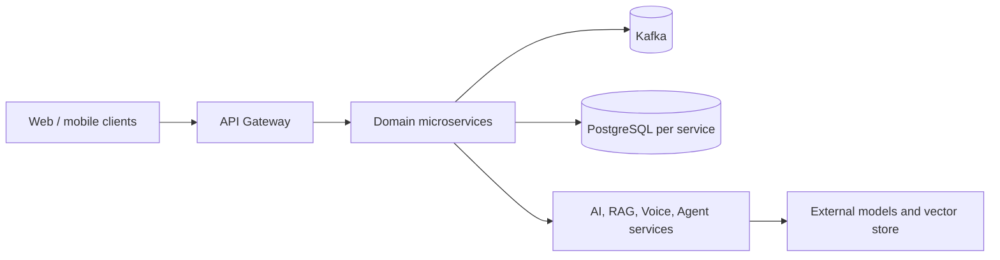
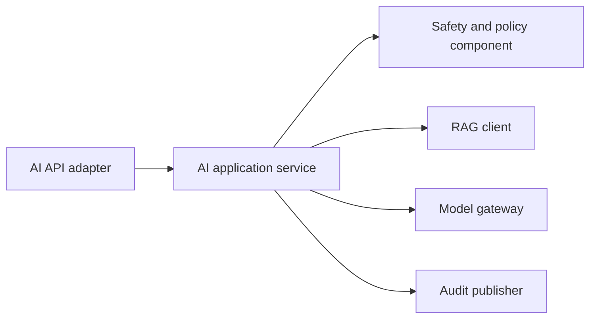

# C4 Model

## Level 1 — System context

See [System Context](SystemContext.md).

## Level 2 — Containers

```mermaid
flowchart LR
  U[Web / mobile clients] --> G[API Gateway]
  G --> S[Domain microservices]
  S --> K[(Kafka)]
  S --> P[(PostgreSQL per service)]
  S --> R[AI, RAG, Voice, Agent services]
  R --> X[External models and vector store]
```

## Level 3 — Component example: AI service

```mermaid
flowchart LR
  API[AI API adapter] --> APP[AI application service]
  APP --> POL[Safety and policy component]
  APP --> RET[RAG client]
  APP --> MOD[Model gateway]
  APP --> AUD[Audit publisher]
```
