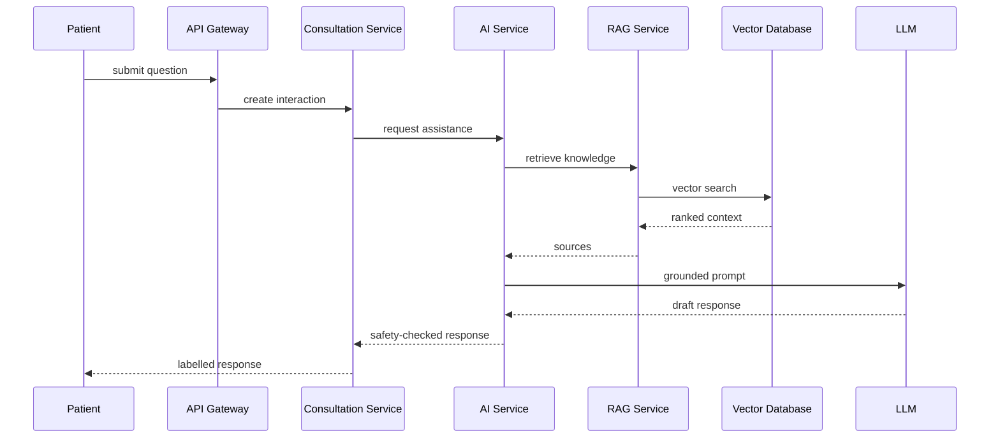
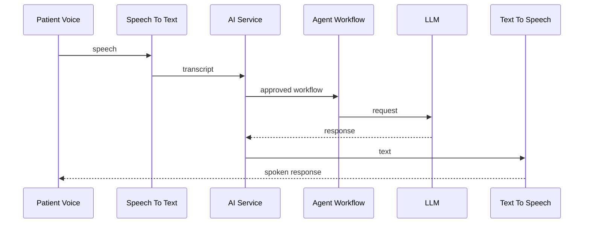
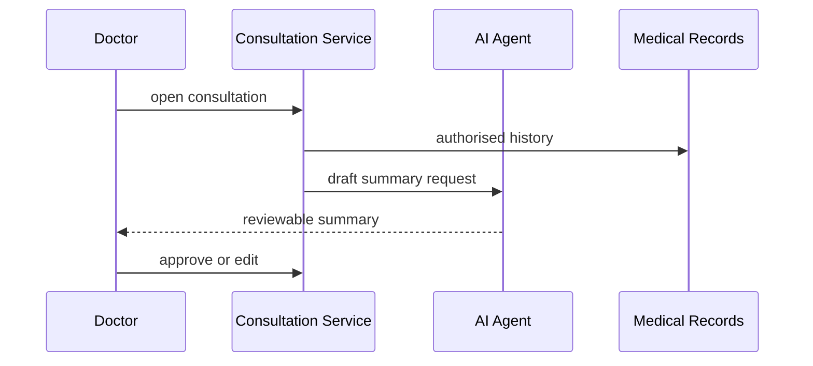
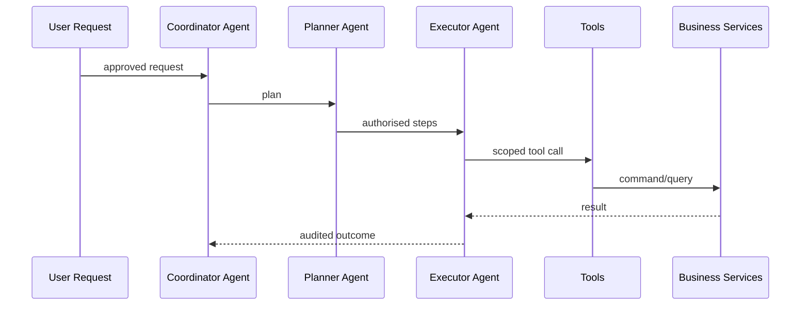

# Sequence Diagrams

## Patient AI Consultation

```mermaid
sequenceDiagram
  participant P as Patient
  participant G as API Gateway
  participant C as Consultation Service
  participant A as AI Service
  participant R as RAG Service
  participant V as Vector Database
  participant L as LLM
  P->>G: submit question
  G->>C: create interaction
  C->>A: request assistance
  A->>R: retrieve knowledge
  R->>V: vector search
  V-->>R: ranked context
  R-->>A: sources
  A->>L: grounded prompt
  L-->>A: draft response
  A-->>C: safety-checked response
  C-->>P: labelled response
```

## Voice Consultation

```mermaid
sequenceDiagram
  participant P as Patient Voice
  participant STT as Speech To Text
  participant A as AI Service
  participant W as Agent Workflow
  participant L as LLM
  participant TTS as Text To Speech
  P->>STT: speech
  STT->>A: transcript
  A->>W: approved workflow
  W->>L: request
  L-->>A: response
  A->>TTS: text
  TTS-->>P: spoken response
```

## Doctor Copilot

```mermaid
sequenceDiagram
  participant D as Doctor
  participant C as Consultation Service
  participant A as AI Agent
  participant M as Medical Records
  D->>C: open consultation
  C->>M: authorised history
  C->>A: draft summary request
  A-->>D: reviewable summary
  D->>C: approve or edit
```

## Agent Workflow

```mermaid
sequenceDiagram
  participant U as User Request
  participant C as Coordinator Agent
  participant P as Planner Agent
  participant E as Executor Agent
  participant T as Tools
  participant B as Business Services
  U->>C: approved request
  C->>P: plan
  P->>E: authorised steps
  E->>T: scoped tool call
  T->>B: command/query
  B-->>E: result
  E-->>C: audited outcome
```
