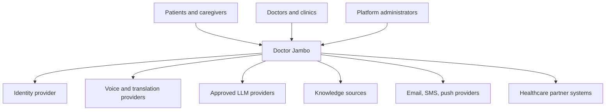

# System Context

```mermaid
flowchart TB
  P[Patients and caregivers] --> DJ[Doctor Jambo]
  D[Doctors and clinics] --> DJ
  A[Platform administrators] --> DJ
  DJ --> ID[Identity provider]
  DJ --> V[Voice and translation providers]
  DJ --> L[Approved LLM providers]
  DJ --> K[Knowledge sources]
  DJ --> N[Email, SMS, push providers]
  DJ --> H[Healthcare partner systems]
```

Doctor Jambo is the system of engagement. External providers are integrated through controlled, auditable adapters; they do not own Doctor Jambo domain data.
