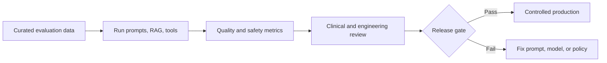

# AI Evaluation

Evaluation is continuous and release-gated. Curated, de-identified test sets cover grounding, medical safety, language, bias, refusal, tool use, retrieval, and adversarial prompts. Offline evaluation precedes controlled production monitoring; human clinical reviewers adjudicate high-risk cases and regression failures.

