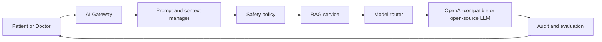

# AI Platform Architecture

## Purpose

Provide a provider-neutral, governed architecture for patient and clinician AI assistance.

## Architecture

Spring AI is the primary application integration layer; LangChain4j and Embabel may support specialised orchestration; MCP exposes tightly permissioned tools. An AI gateway applies identity, consent, prompt policy, safety, retrieval, model routing, audit, and observability before an output reaches a user.

## Requirements

Model calls shall be policy-bound, traceable, and least-privilege. Patient data is sent only when authorised and minimised.
