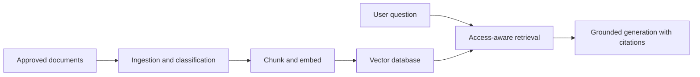

# RAG Architecture

Approved medical knowledge is ingested, classified, chunked, embedded, versioned, and indexed. Retrieval applies access filters, source authority, freshness, relevance thresholds, and citation capture before response generation.

Low-confidence or conflicting retrieval triggers clarification, human review, or safe limitation language.
