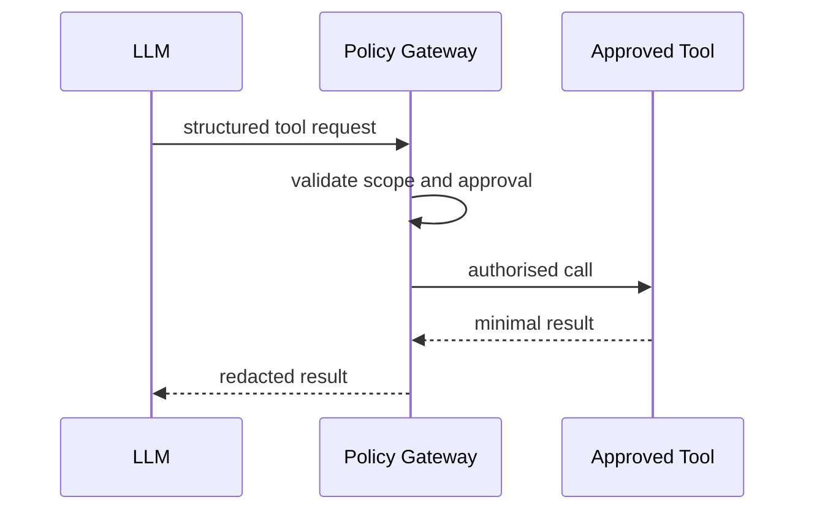
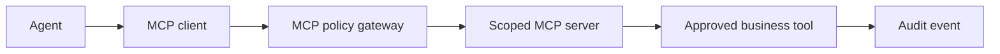

# Tool Calling and MCP Architecture

Tools are typed, allowlisted, scoped, time-bounded capabilities; the model never receives unrestricted network or database access. MCP servers publish declared tools and permissions. A policy gateway validates identity, purpose, arguments, approval state, and result redaction.

