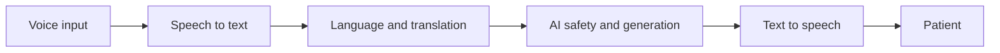

# Voice AI Architecture

Voice interactions require notice and consent. Speech-to-text supplies confidence and correction; language detection selects approved translation; AI processes reviewed text; text-to-speech returns the answer with transparent processing state. Audio and transcript retention follow patient-data policy.

