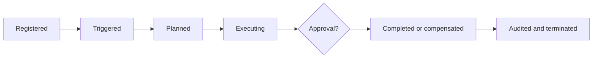

# Agent Lifecycle

An agent is registered with an owner, goal, permitted data, tools, event contracts, budget, and termination conditions. It receives a validated trigger, builds or receives a plan, executes scoped steps, awaits approval where required, records outcome, and terminates or compensates safely.

