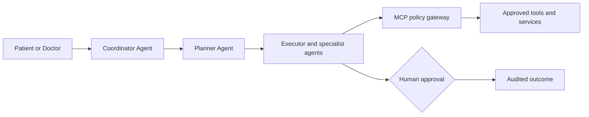

# Agent Platform Architecture

Spring AI integrates model and tool capabilities; LangChain4j supports agent abstractions and Embabel supports structured orchestration where approved. A policy-controlled agent service owns lifecycle and workflow state. MCP provides typed, scoped tools behind a gateway; business services remain authoritative.

