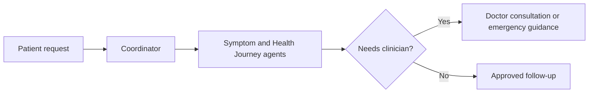
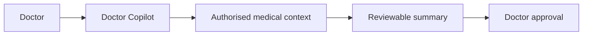
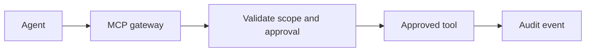

# Core Workflows

```mermaid
flowchart LR
  P[Patient request] --> C[Coordinator]
  C --> S[Symptom and Health Journey agents]
  S --> R{Needs clinician?}
  R -- Yes --> D[Doctor consultation or emergency guidance]
  R -- No --> F[Approved follow-up]
```

```mermaid
flowchart LR
  D[Doctor] --> C[Doctor Copilot]
  C --> M[Authorised medical context]
  M --> S[Reviewable summary]
  S --> A[Doctor approval]
```

```mermaid
flowchart LR
  A[Agent] --> G[MCP gateway]
  G --> V[Validate scope and approval]
  V --> T[Approved tool]
  T --> E[Audit event]
```
