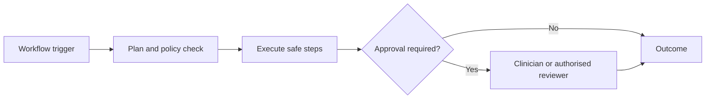

# Workflow and Human Approval

Health workflows begin with an explicit trigger and policy. Human approval is mandatory before patient-facing clinical interpretation, medication guidance or changes, external side effects, clinician-record updates, and any configured high-risk action.

