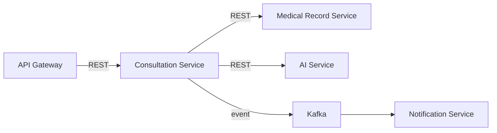
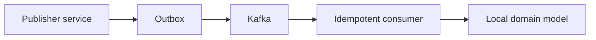
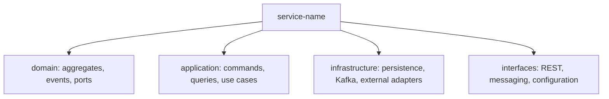

# Communication and Package Structure

Synchronous REST APIs are versioned and used for immediate commands or queries; Kafka transports durable, asynchronous domain events. Consumers are idempotent, correlated, observable, and retry/dead-letter capable.

