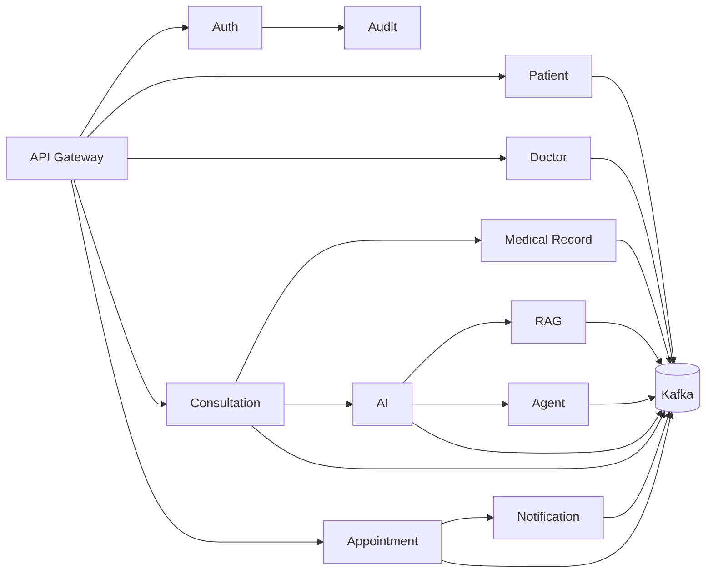

# Service Architecture

All services own a PostgreSQL datastore or explicitly owned operational store. Kafka events propagate completed domain facts. Hexagonal ports isolate REST, Kafka, persistence, and external adapters.
